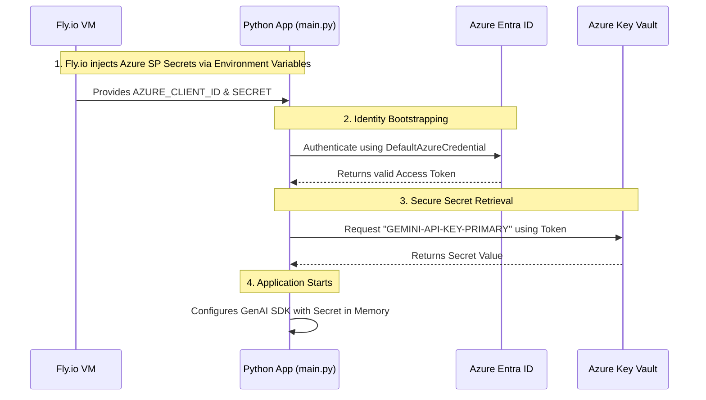

# 🧪 Architecture: Moving from Doppler to Azure Key Vault on Fly.io

Moving from Doppler to Azure Key Vault represents a shift from an **"environment-injected"** architecture to an **"identity-bootstrapped"** architecture. 

While Doppler uses a CLI wrapper (`doppler run`) to inject all secrets as environment variables before the app starts, Azure Key Vault requires the application to fetch the secrets itself. To do this securely on a third-party host like Fly.io, we use **Azure Service Principals**.

## 💡 The Core Idea
Instead of storing *all* your API keys in Fly.io secrets (or Doppler), you only store **three pieces of information** in Fly.io: your Azure Identity (`AZURE_CLIENT_ID`, `AZURE_TENANT_ID`, `AZURE_CLIENT_SECRET`). 

Your application uses these three variables to prove "who it is" to Microsoft. Once authenticated, the app reaches into your Azure Key Vault to pull down the actual secrets (like `GEMINI-API-KEY-PRIMARY`) directly into runtime memory.

This means you only ever run `flyctl secrets set` once for the Service Principal. After that, you manage all your secrets entirely inside the Azure Portal without ever needing to touch Fly.io again.

---

## 📊 Architecture Diagram

Below is a Mermaid chart detailing the flow of authentication and secret retrieval when the Fly.io app starts up.

---

## 🔐 Why This is Powerful

1. **Centralized Governance:** All application secrets are kept in a single, enterprise-grade vault (Azure Key Vault).
2. **Zero-Redeploy Secret Rotation:** If you change your Gemini API key in Azure Key Vault, you just restart your Fly.io app to fetch the new key. You do not need to run `flyctl secrets set` or rebuild your Docker image.
3. **Blast Radius Reduction:** Fly.io never sees your actual database passwords, API keys, or third-party tokens. It only holds the Service Principal. If Fly.io environment variables were somehow leaked, the attacker only gets the SP. You can instantly revoke that SP in Azure, neutralizing the threat.
